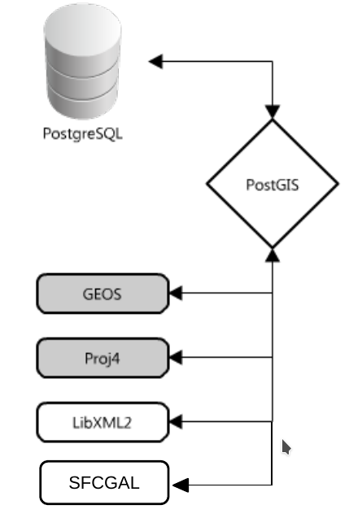
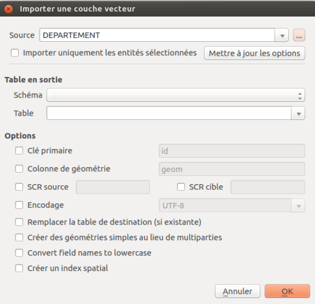
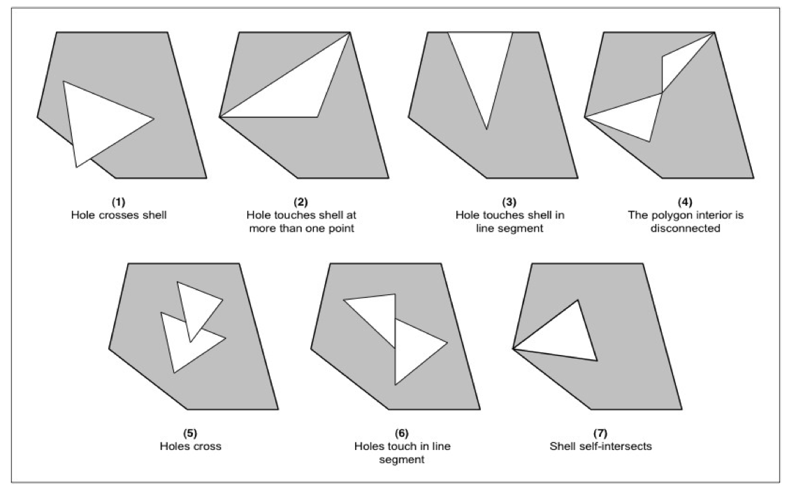
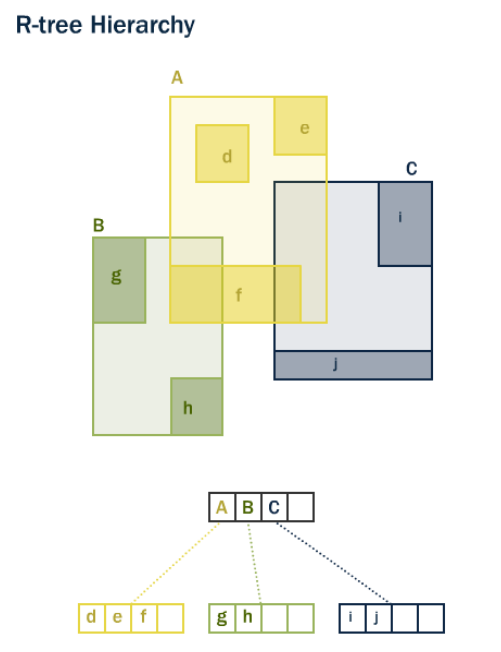
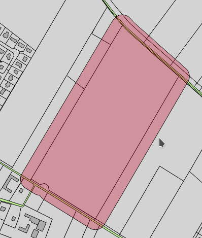
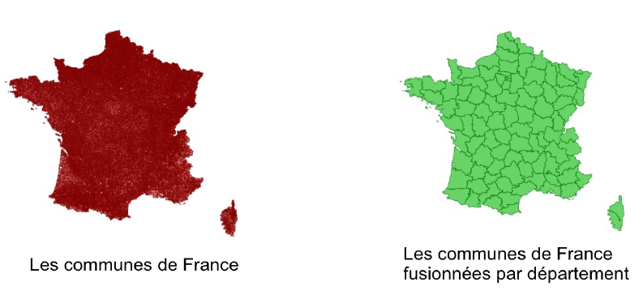
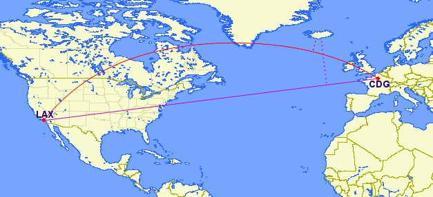
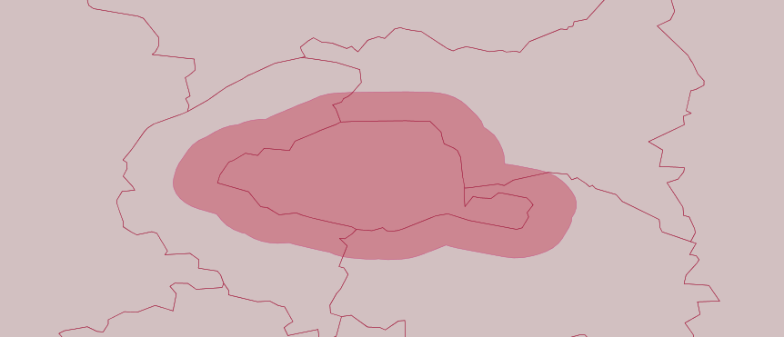
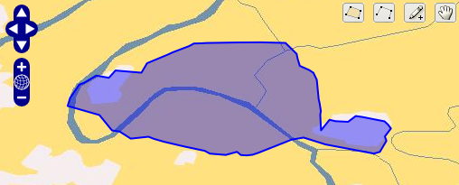

<div id="top"></div>
<div class="fixed left">[Retour en haut](#top)</div>
<div class="fixed right">[www.oslandia.com](http://www.oslandia.com) </div>


# PostGIS - Introduction

Bienvenue dans ce workshop PostGIS introduction (débutant). Vous y découvrirez cette extension spatiale de PostgreSQL au travers de quelques exercices et cas pratiques. 

Quelques liens utiles pour commencer:

* Site PostGIS: [http://www.postgis.net](http://www.postgis.net)
* Documentation PostGIS : [http://www.postgis.net/documentation/](http://www.postgis.net/documentation/)
* Documentation PostgreSQL : [https://www.postgresql.org/docs/current/index.html](https://www.postgresql.org/docs/current/index.html)
* Ce workshop sur Github : [https://github.com/Oslandia/postgis-workshop](https://github.com/Oslandia/postgis-workshop)
* Validation GeoJSON : [http://geojsonlint.com/](http://geojsonlint.com/)


## Plan du workshop (indicatif)

$$$sommaire


## Pour bien commencer

Commencez par télécharger la dernière version de ce workshop :

[https://github.com/Oslandia/postgis-workshop/archive/master.zip](https://github.com/Oslandia/postgis-workshop/archive/master.zip)

Sauvegardez le zip dans votre répertoire home et décompressez le dans un répertoire _workshop_.

```bash
$ cd ~
$ wget -O postgis-workshop-master.zip 'https://github.com/Oslandia/postgis-workshop/archive/master.zip'
$ mkdir workshop
$ unzip -o postgis-workshop-master.zip -d workshop
$ cd workshop/postgis-workshop-master
```

La première étape est de créer la base de données et de charger les données

Lancez les 3 scripts contenus dans le répertoire _scripts_ pour créer la base, téléchargez le jeu de test, et chargez les données dans la base.

Pour charger les shapefiles, vous pouvez aussi utiliser l'utilitaire _shp2pgsql-gui_.

Vous pouvez relancer les scripts si une erreur se produit pendant l'exécution.


```bash
$ cd scripts
$ sudo -u postgres bash STEP_1-CREATE.sh
$ bash STEP_2-DOWNLOAD-DATA.sh
$ sudo -u postgres bash STEP_3-LOAD.sh
```

A présent, vous pouvez utiliser PGAdmin3 (ou 4) pour parcourir vos données et QGIS pour les visualiser.

Essayez d'appliquer une belle symbologie pour les couches de données dans QGIS, et vous pourrez passer à l'étape suivante.


### PostGIS, qu'est-ce que c'est ?


PostGIS est une extension du SGBD PostgreSQL. Elle permet de manipuler des données spatiales (géographique) en respectant les standards de l'OGC (Open Geospatial Consortium).

Elle apporte :

* des types de données (geometry, geography...)
* des fonctions de manipulation de donnée (géométrique)
* des tables et vues nécessaires au bon fonctionnement de PostGIS


### Installation de PostGIS sous linux

Dans un environnement Linux, l'installation est très facile. Il suffit d'installer les paquets disponibles pour votre distribution. Exemple sous Ubuntu :

```
sudo apt-get install postgresql-10-postgis-2.4
```


A l'issue de l'installation, un serveur PostgreSQL tournera sur votre machine et PostGIS sera disponible. Un utilisateur système **postgres** sera également disponible et vous permettra d'effectuer des opération d'administration sur votre serveur PostgreSQL.

Exemple:

```
-- on se loggue en utilisateur postgres
sudo su - postgres

-- on crée une base de données
createdb test
```

> Rappel: PostgreSQL est un serveur de base de données, il est installé sur une machine et agit comme un service, attendant des requêtes qui lui sont envoyées.


### Installation de PostGIS sous windows

Sous Windows, EnterpriseDB fournit un [binaire](https://www.enterprisedb.com/downloads/postgres-postgresql-downloads). Le programme vous invite à installer PostgreSQL. A l'issue de l'installation, un programme annexe vous proposera d'installer des logiciels tierces. Vous y choisirez PostGIS. Suivez les étapes d'installations. Si tout se passe bien, vous devriez voir apparaître un nouveau service postgresql.


> Note: sous windows, il sera nécessaire de saisir un mot de passe pour l'utilisateur système postgres (ce n'est pas le cas sous linux)


## PostGIS: introduction


### Standards

[OGC Simple Feature Access (1.2.1) (ISO 19125)](http://www.opengeospatial.org/standards/sfa)

ISO SQL/MM Part 3 (ISO 13249)

Ce qui est spécifié :

* types de géométries
* prototypes de fonctions
* tables additionnelles pour intégrité référentielle


### Architecture

PostGIS peut être considéré comme un plugin de PostgreSQL. Cette extension est écrite principalement en langage C.
Elle fait appel a des librairies tierces :



PostGIS implémente OGC SFS et une grande partie de ISO SQL/MM. PostGIS offre en plus de nombreuses fonctions additionnelles.

### Histoire

* 2001 Première version alpha
* 2003 Version 0.8 – Utilisation en production
* 2005 Version 1.0 – Réécriture du coeur et LWGEOM (OGC SFS 1.1)
* 2006 Version 1.2 – Cap sur ISO SQL/MM (Curves, préfixes ST_...)
* 2009 Version 1.4 – Création d'un PSC et entrée OSGeo
* 2010 Version 1.5
* 2012 Version 2.0 – Support Tin et Polyhedral (3D), Raster
* 2013 Version 2.1
* 2015 Version 2.2 – recherche plus proche voisin, TWKB...)
* 2016 Version 2.3 – Pour PG 9.6 (début de support parallélisme index scan)
* 2017 Version 2.4 – Support pour PG 10 (parallélisme aggrégations , Vector Tiles Mapbox
* 2018 Version 2.5


### Communauté

* Institutionnels
    * IGN : Institut Géographique National
    * IRSN : Institut de Radioprotection et de Sûreté Nucléaire
    * JRC : Joint Research Center – Union Européenne
    * BRGM : Bureau de Recherches Géologiques et Minières
    * ... et un directive ministérielle préconisant son utilisation

* Entreprises françaises
    * Mediapost, France Telecom, Veolia, RFF, MeteoFrance, Mappy, MichelinTP ...

* Communauté
    * Mondiale
    * Plusieurs milliers d'utilisateurs
    * Mailing-list postgis-users très active

### Commiters PostGIS

* CadCorp
* LisaSoft
* OpenGeo
* Oslandia
* Paragon Corporation
* Refractions Research
* Sandro Santilli
* Sirius

### Comparaison avec d'autres SGBD spatiaux

* Oracle Spatial (et Locator)
* ESRI ArcSDE
* IBM DB2
* Microsoft SQLServer 2008
* SpatiaLite

### Sites de références

* [https://postgis.net/](https://postgis.net/)

### Documentation

* [https://postgis.net/documentation/](https://postgis.net/documentation/)

> L'utilisation de la documentation au format PDF est très pratique car elle permet la recherche rapide de texte.

### CheatSheets

Un bon résumé (quoiqu'un peu ancien) des fonctions proposées par PostGIS :

* [http://www.postgis.us/downloads/postgis21_cheatsheet.pdf](http://www.postgis.us/downloads/postgis21_cheatsheet.pdf)

Vous pouvez rapidement identifier les fonctions qui vous serviront au quotidien.


## Les outils


### PSQL

Cet utilitaire fait partie de PostgreSQL (il est installé par défaut avec PostgreSQL). Il fonctionne en ligne de commande et permet d'intéragir de manière complète sur une base PostgreSQL.
Il peut être utilisé aussi depuis un serveur distant en SSH.


```
psql [OPTIONS]... [NOM_BASE [NOM_USER]]
```

Exemples:

```
psql -U NOM_USER NOM_BASE

psql -h 127.0.0.1 -U NOM_USER -d NOM_BASE -p 5432

Lister les bases existante
Via la commande psql:
psql -l

En mode interactif:
\l

Changer de base (en mode interactif):
\c NOM_BASE

Lister les tables, séquences, index ou vue de la base courante:
\d
Lister les tables d'un schéma:
\dt
\d NOM_SCHEMA.*
Lister la structure d'une table
\d NOM_TABLE
\d NOM_SCHEMA.NOM_TABLE
```

Via un shell (terminal) :

```
Exécuter une commande SQL directement :

psql -d NOM_BASE -c "SELECT * FROM my_table"

Exécuter un fichier contenant des commandes :

psql -d NOM_BASE < sql_file.sql
```


> Attention à
> 1) Se croire (à tort) dans un shell et lancer des commandes système
> 2) L'inverse du précédent
> 3) Faire un SELECT, sans utiliser LIMIT sur une grosse table (interrompre avec Ctrl+C (voire Ctrl+Z))
> 4) Oublier le « ; » final dans une commande SQL (et ne pas comprendre pourquoi la requête ne s'exécute pas)
> 5) Corollaire: ne pas respecter les fermetures de parenthèses ou guillemets

### PGAdmin

PGAdmin est un client graphique pour administrer et requêter vos bases PostgreSQL.


### QGIS

QGIS est un logiciel SIG bureautique. Leader des logiciel SIG OpenSource, très utilisé et bénéficiant d'une grande communauté.
Nous allons nous en servir tout au long de la formation pour visualiser nos données.

Il est par exemple possible d'importer des fichier SHP depuis QGIS vers une base PostGIS :

* 1. Charger la couche sous QGIS
* 2. Régler l'encodage si besoin
* 3. Créer la connexion à la base de données PostGIS
* 4. "Importer une couche vecteur" depuis DB manager





## Premiers pas


### Créer une nouvelle base

```sql
create database formation;
```

### Chargement de PostGIS

```sql
create extension postgis;
```

Cette commande charge PostGIS sur la base courante et ajoute:

* Types géométriques PostGIS
* Prototypes des fonctions et opérateurs C PostGIS
* Fonctions Pl/PgSQL PostGIS

Elle ajoute également une table dans le schéma public:

* spatial_ref_sys: catalogue des systèmes de projection


et 4 vues:

* geometry_columns
* geography_colums
* raster_columns
* raster_overviews

Ces vues référencent les objets de la base qui possèdent des caractéristiques spatiales.

Pour vérifier quelle version de PostGIS est installée sur une base :

```sql
 select postgis_full_version();

```

Vérifions que les metadonnées sont correctement paramétrées

```SQL

select * from geometry_columns;
```


## Les géométries

### WKT

Le format WKT (Well Known Text) est une représentation textuelle de géométries.

```sql
POINT(10 10)
```


### WKB
Le format Geometry (ou HEWKB) est une représentation binaire avec encodage hexa de géométries.

```sql
01010...54D3A5F
```


### Dimensions

PostGIS sait gérer des données dans diverses dimensions: 2D, 3D, ou 4D.

### Projection

PostGIS gère les projections de données. La table spatial_ref_sys contient toutes les définitions de projection dont vous pourrez avoir besoin. Si un système n'est pas présent dans cette table, vous pouvez tout à fait le rajouter.

Les projections ont toutes un identifiant appelé SRID.

PostGIS ne fera jamais implicitement de transformation de projection. Il est de votre responsabilité de savoir dans quelle projection sont vos données. Ainsi il est tout à fait possible d'insérer en base des données avec une mauvaise projection. PostGIS n'en n'aura pas connaissance et prendra comme acquise l'information que vous lui donner.


### Point (Point)

Représentation WKT :

```sql
POINT(10 10)
```


### Ligne (LineString)

Représentation WKT :

```sql
LINESTRING
(
0 5, 5 1, 9 4, 2 14, 14 13, 4 4
)
```


### Polygone (Polygon)

Représentation WKT :

```sql
POLYGON
(
(9 13,13 9,13 3,4 2,1 4,1 12, 9 13),
(5 11,5 6,1 9,5 11),
(10 7, 10 4, 6 4, 8 8, 10 7)
)
```

* Le premier ring (obligatoire) correspond au ring externe
* Les coordonnées des rings sont fermantes
* Les rings suivants (optionels) correspondent à des 'trous'

Les polygones peuvent être invalides (au sens OGC SFS) (ce n'est pas le cas des points et lignes qui sont toujours valides).
D'un point de vue technique PostGIS acceptera de les enregistrer en base, par contre le résultat de fonctions spatiales sur des géométries invalides est incertain.


### Types multiples et aggrégats

Il existe des types multiples :

* MULTIPOINT

```sql
MULTIPOINT ((10 40), (40 30), (20 20), (30 10))
```

* MULTILINESTRING

```sql
MULTILINESTRING ((10 10, 20 20, 10 40),
(40 40, 30 30, 40 20, 30 10))
```

* MULTIPOLYGON
```sql
MULTIPOLYGON (((30 20, 45 40, 10 40, 30 20)),
((15 5, 40 10, 10 20, 5 10, 15 5)))
```

* GEOMETRYCOLLECTION
```sql
GEOMETRYCOLLECTION(POINT(2 0), POLYGON((0 0, 1 0, 1 1, 0 1, 0 0))
```


### Courbe (curve)

Les types dits «curves» :

* CIRCULARSTRING
* COMPOUNDCURVE
* MULTISURFACE


### Validité des géométries

Les points sont toujours valides, ainsi que les linestring. Pour les polygones, il y a plusieurs cas.




Vérifions si le jeu de données contient des géométrie invalides

```SQL

SELECT gid, ST_IsValidReason(geom) 
FROM hydro.region 
WHERE NOT ST_IsValid(geom);

SELECT gid, ST_IsValidReason(geom) 
FROM admin.commune 
WHERE NOT ST_IsValid(geom);
```


NOTE : les données de type POINT sont toujours valides, la vérification est surtout faite pour les données surfaciques.


A propos de la requête :

- Qu'est-ce qu'une géométrie invalide ?
- Spécifications OGC SFS


### Indexes

Améliorer les performances sur filtrage. Approxime les géométries (Stockage de la Bbox de la géométrie dans l'index).

Ils fonctionnent comme des index classiques.

Permettent d'accélérer les requêtes sur des SELECT avec une clause WHERE basée sur des données spatiales.

Ils ralentissent de fait les tâches d'écriture en base (INSERT / UPDATE).

Ils utilisent le mécanisme GiST (Generalized Search Tree) de PostgreSQL.


Création d'un index spatial:

```sql
CREATE INDEX index_name ON table_name
USING GIST(geom_column_name);
```



Regroupement des Bbox dans des régions de l'index.

Le gain sur l'exécution de requête peut-être très important. La gestion des index est un sujet important lorsqu'on construit une base de données spatiale.

Une règle simple veut que l'on positionne des indexes sur tous les champs présents dans les filtres des requêtes (derrière le **where**).


```sql
-- La requête suivante est plus ou moins performante si des indexes sont présents sur la table des communes

SELECT 
	c1.nom 
FROM 
	communes c1, communes c2 
WHERE 
	c2.nom = 'Toulouse' 
	AND ST_Touches(c1.the_geom, c2.the_geom);
	
```

Vérifions si les index spatiaux ont été correctement créés, avec PGAdmin ou psql (commande \di).


## Les basiques

### Créer une géométrie

La fonction [ST_GeometryFromText](https://postgis.net/docs/ST_GeometryFromText.html) permet de créer une géométrie à partir d'une définition WKT. Il est nécessaire de préciser la projection des données que le souhaite convertir.

[ST_GeomFromText](https://postgis.net/docs/ST_GeomFromText.html) est une variante de ST_GeometryFromText.


```sql
select ST_GeometryFromText('POINT(454877 6902550)', 2154);

Note : on peut remplacer ST_GeometryFromText(...) par : 'SRID=2154;POINT(454877 6902550)'::geometry
```

Quelques exemples :

```SQL

-- Créons une géométrie à l'aide d'un CAST :
SELECT ST_AsText('POINT(10 10)'::geometry);

-- Idem que précédement mais en incluant le SRID :
SELECT ST_AsEWKT('SRID=4326;POINT(10 10)'::geometry);

-- autre façon :
SELECT ST_AsEWKT(ST_SetSRID('POINT(10 10)'::geometry, 4326));

```

[ST_SRID](https://postgis.net/docs/ST_SRID.html) retourne le SRID d'une géométrie.

[ST_SetSRID](https://postgis.net/docs/ST_SetSRID.html) force le SRID d'une colonne géométrique. Cette fonction peut être utilisée lorsque que des données ont été importée sans information de projection.


Créons une géométrie à partir de longitudes et latitudes :

 
```SQL
SELECT ST_SetSRID(ST_MakePoint(longitude_wgs84, latitude_wgs84), 4326) AS geom
FROM rff.station;
```

[ST_MakePoint](https://postgis.net/docs/ST_MakePoint.html) permet de créer un point.


La même chose en incluant un identifiant pour visualiser la donnée sous QGIS :


```SQL
SELECT (row_number() OVER ()) AS gid,
       ST_SetSRID(ST_MakePoint(longitude_wgs84, latitude_wgs84), 4326) AS geom
FROM rff.station;
```

Autre façon de faire :

```SQL
SELECT (row_number() OVER ()) AS gid,
       ('SRID=4326; POINT('||longitude_wgs84||' '||latitude_wgs84||')')::geometry AS geom
FROM rff.station;
```


### ST_AsText

Par défaut, les géométries sont affichéres en binaire :

```sql
SELECT geom 
FROM admin.commune
LIMIT 10;
```

[ST_AsText](http://www.postgis.org/docs/ST_AsText.html) permet de voir en mode texte (WKT) une géométrie :

```sql
select ST_AsText(geom)
from capitals;
```

Conseil : 
- PGAdmin a parfois du mal à afficher la données si elle est trop lourde (préférez psql pour ça)


### ST_Summary

[ST_Summary](https://postgis.net/docs/ST_Summary.html) permet de récupérer des informations (structure) sur les géometries :

```SQL

SELECT ST_Summary(geom) 
FROM admin.commune
LIMIT 10;
```


## Analyses basiques

### ST_Area

[ST_Area](https://postgis.net/docs/ST_Area.html) calcule l'aire d'une géométrie.

Trouvons les communes populaires.

```SQL

-- Récupérons les 100 communes les plus denses

SELECT * 
FROM admin.commune 
ORDER BY population / ST_Area(geom) DESC
LIMIT 100;
```

Affichez le résultat dans QGIS à l'aide du DBManager (ou créez une table temporaire).


### ST_Touches

[ST_Touches](https://postgis.net/docs/ST_Touches.html) renvoie vrai si les géométrie se touchent par un point ou une ligne.


Récupérons toutes les communes situées autours de celle nommée Toulouse

```SQL

SELECT c.gid, c.geom, c.nom_com
FROM admin.commune AS c
WHERE ST_Touches( c.geom, 
                  (SELECT geom FROM admin.commune WHERE nom_com = 'TOULOUSE')
                )
;
```

Affichez le résultat dans QGIS à l'aide du DBManager


### ST_Length

[ST_Length](https://postgis.net/docs/ST_Length.html) calcule la longueur d'une géométrie de type Line.


Quelles rivières sont les plus longues ?

 
```SQL

SELECT SUM(ST_Length(geom)), toponyme
FROM hydro.cours_eau
WHERE toponyme IS NOT NULL
GROUP BY toponyme
ORDER BY SUM(ST_Length(geom)) DESC
LIMIT 10;
```

Note:

- le premier résultat est du au fait que les données sont incomplètes

A propos de la requête :

- NULL / NOT NULL
- GROUP BY et les fonction d'aggrégation (telle que SUM)
- ORDER BY ASC / DESC
- LIMIT


### ST_Buffer

[ST_Buffer](http://www.postgis.net/docs/ST_Buffer.html) retourne un buffer (zone tampon) autours ou à l'intérieur (buffer négatif) d'une géométrie.



```sql
SELECT ST_Buffer(geom, 10000) AS geom, gid from admin.commune where nom_com = 'TOULOUSE';

```

Faisons des buffers (zones tampons) autours des communes, puis autours des communes frontalières de Toulouse.


### ST_Distance


[ST_Distance](https://postgis.net/docs/ST_Distance.html) sert à mesurer la distance minimale entre deux géométries. Cette fonction retourne une valeur numérique exprimée dans l'unité de la projection courante (si nos données sont en L93, alors les résultats seront exprimés en mètres).

Quelles sont les distances entre Toulouse et les autres grandes communes ?

```sql
SELECT nom_com,
       population AS population,
       ST_Distance(geom, (SELECT geom FROM admin.commune WHERE nom_com = 'TOULOUSE')) / 1000 AS dist_km
FROM admin.commune
WHERE population > 150000
AND NOT nom_com = 'TOULOUSE';

```

A propos de la requête :

- Sous-requêtes SQL


## Aggrégations

### ST_Union (aggrégation)

[ST_Union](https://postgis.net/docs/ST_Union.html) effectue l'union de géométries (aggrégation).


Agrégeons les communes d'une même région :


```SQL
SELECT code_reg,
       ST_Union(geom) AS geom
FROM admin.commune
GROUP BY code_reg;
```




On ajoute un identifiant unique pour que QGIS puisse afficher la donnée :


```SQL
SELECT (row_number() OVER ())::integer AS gid, 
       code_reg,
       ST_Union(geom) AS geom
FROM admin.commune
GROUP BY code_reg;
```


A propos de la requête :
- row_number() et SQL WINDOWING


### ST_Collect


Idem que précédement, mais cette fois-ci en utilisant _ST_Collect_ à la place de _ST_Union_


[ST_Collect](https://postgis.net/docs/ST_Collect.html) est assez similaire à ST_Union, sauf que qu'elle retourne toujours une geometry collection. Là où ST_Union pourra renvoyer des géométries fusionnées simple, ST_Collect renverra toujours des multi géométries.

[ST_CollectionExtract](https://postgis.net/docs/ST_CollectionExtract.html) permet d'extraire d'une collection le sobjets d'un type particulier.

```SQL
SELECT (row_number() OVER ())::integer AS gid, 
       ST_CollectionExtract(ST_Collect(geom), 3) AS geom  -- 3 est le type polygone
FROM admin.commune
GROUP BY code_reg;
```

A propos de la requête : 

- Qu'est-ce qu'un MULTI*, qu'est-ce qu'une COLLECTION
- Pourquoi ST_Collect is plus rapide que ST_Union


### D'autres fonction de collecte


Comme précédement, mais en utilisant [ST_CollectionHomogenize](https://postgis.net/docs/ST_CollectionHomogenize.html) à la place de _ST_CollectionExtract_. ST_CollectionHomogenize renvoie la version la plus simple d'une collection.


```SQL
SELECT (row_number() OVER ())::integer AS gid, 
       ST_CollectionHomogenize(ST_Collect(geom)) AS geom
FROM admin.commune
GROUP BY code_reg;
```


### Fusion de lignes

Récupérons et agrégeons toutes les LINESTRING composant le fleuve Rhone en une seule géométrie


[ST_LineMerge](https://postgis.net/docs/ST_LineMerge.html) permet de consituer une multilinestring à partir de linestrings.

```SQL
SELECT
   ST_Summary(ST_LineMerge(ST_CollectionExtract(ST_Collect(geom), 2))) AS geom,
   ST_Summary(ST_CollectionExtract(ST_Collect(geom), 2)) AS geom 
FROM hydro.cours_eau 
WHERE code_hydro = 'V---0000';
-- Code Hydrologique du Rhone

```

Pour visualiser sous QGIS:


```SQL
SELECT 1::integer AS gid,
      ST_LineMerge(ST_CollectionExtract(ST_Collect(geom), 2)) AS geom
FROM hydro.cours_eau 
-- Hydrological code from Rhone river
WHERE code_hydro = 'V---0000';
```


## Accesseurs

Agrégeons une rivière.

Récupérons le nombre de points de la géométrie.

Récupérons un point spécifique dans la géométrie.

```SQL

WITH rhone AS 
(
  SELECT ST_LineMerge(ST_CollectionExtract(ST_Collect(geom), 2)) AS geom 
  FROM hydro.cours_eau 
  WHERE code_hydro = 'V---0000'  -- Code hydrologique du Rhone
)


SELECT ST_Summary(geom), 
       ST_NumPoints(geom), 
       ST_AsText(ST_PointN(geom, 55)) AS p_55

FROM rhone;
```

A propos de la requête :

- Qu'est-ce qu'une CTE
- [ST_NumPoints](https://postgis.net/docs/ST_NumPoints.html)
- [ST_PointN](https://postgis.net/docs/ST_PointN.html)


* Récupération de tous les points

Si on veut récupérer tous les points du linéaire de la rivière, il faut utiliser une boucle. On va utiliser _generate_series(i, j)_ :


```SQL
select generate_series(1, 55);

select * from generate_series(1, 55);
```


```SQL
WITH rhone AS 
(
  SELECT ST_LineMerge(ST_CollectionExtract(ST_Collect(geom), 2)) AS geom 
  FROM hydro.cours_eau 
  WHERE code_hydro = 'V---0000'  -- Code hydrologique du Rhone
)
SELECT generate_series(1, ST_NumPoints(geom)) as n
FROM rhone;
```

A propos de la requête :

- boucle generate_series
- Idem que précédement avec une boucle sur chaque point

A présent, récupérons les points :

```SQL
WITH rhone AS 
(
  SELECT ST_LineMerge(ST_CollectionExtract(ST_Collect(geom), 2)) AS geom 
  FROM hydro.cours_eau 
  WHERE code_hydro = 'V---0000'  -- Code hydrologique du Rhone

), loop AS (
  SELECT generate_series(1, ST_NumPoints(geom)) AS n
  FROM rhone
)
SELECT n, ST_AsText(ST_PointN(geom, n))
FROM rhone, loop;

```

Enfin, la requête pour afficher les données dans QGIS:

```SQL
WITH rhone AS 
(
  SELECT ST_LineMerge(ST_CollectionExtract(ST_Collect(geom), 2)) AS geom 
  FROM hydro.cours_eau 
  WHERE code_hydro = 'V---0000'  -- Code hydrologique du Rhone

), loop AS (
  SELECT generate_series(1, ST_NumPoints(geom)) AS n
  FROM rhone
)

SELECT n::integer AS gid, ST_PointN(geom, n) AS geom
FROM rhone, loop;
```

On pourrait utiliser le format GeoJSON


Afficher une géométrie au format GeoJSON

> Résultat à tester sur http://geojsonlint.com/


```SQL
WITH rhone AS 
(
  SELECT ST_LineMerge(ST_CollectionExtract(ST_Collect(geom), 2)) AS geom 
  FROM hydro.cours_eau 
  WHERE code_hydro = 'V---0000'  -- Code hydrologique du Rhone

)

SELECT substring(ST_AsGeoJSON(ST_Transform(geom, 4326), 5) from 1 for 300)
FROM rhone;
```

Autre affichage en GeoJSON :

```SQL
select 
    ST_AsGeojson(ST_Collect(ST_Transform(geom, 4326)), 5) 
from (
    select 
        * 
    from 
        admin.commune 
    where 
        code_dept = '69'
) as coms;
```

A propos de la requête :
- [ST_AsGeoJSON](http://www.postgis.org/docs/ST_AsGeoJSON.html)
- Nombre de décimales a utiliser


- Testez les résultats sur ce site : http://geojsonlint.com/
- Affichez les résultats sur une carte en utilisant par exemple : http://geojson.io


## Type Geography

La terre n'est pas plate, et on veut parfois ne pas travailler dans un système de projection. Pour cela, PostGIS propose un type **geography**.

```sql
create table capitals (
    id serial,
    name varchar,
    geom geography(POINT,4326)
);
```

Limitations :

* Latitude/Longitude seulement (SRID:4326 si PostGIS < 2.1.6)
* pas toutes les fonctions PostGIS implémentées
* fonctionne avec tous les standards OGC sauf les courbes (*CURVES)

Petit exercice pratique sur le type géographique, nous allons prendre l'exemple connu d'un avion faisant le trajet Paris / Los Angeles. A combien de Km passe-t-il de l'Islande ?


Ecrivez la requête permettant de calculer la distance entre une ligne de coordonnées -118.4079 33.9434, 2.5559 49.0083 et un point de coordonnées 2.5559 49.0083. Exprimez le résultat en projection mercator (SRID = 3857).

```sql

-- Requête en prenant la projection mercator :

SELECT ST_Distance(
  ST_transform(ST_GeomFromText('LINESTRING(-118.4079 33.9434, 2.5559 49.0083)', 4326), 3857),
  ST_transform(ST_GeomFromText('POINT(-21.8628 64.1286)', 4326), 3857)
);

```


Ecrivez la même requête en utilisant cette fois-ci le type geography (il faut donc utiliser la fonction [ST_GeographyFromText](https://postgis.net/docs/ST_GeographyFromText.html) ou l'opérateur de CAST ::geography).


```sql

-- Avec le type geography :
-- Distance entre une ligne Paris/ Los Angeles, et l'Islande
SELECT ST_Distance(
  ST_GeographyFromText('LINESTRING(-118.4079 33.9434, 2.5559 49.0083)'), -- LAX-CDG
  ST_GeographyFromText('POINT(-21.8628 64.1286)')                        -- Iceland
);

-- ou

SELECT ST_Distance(
  ST_GeomFromText('LINESTRING(-118.4079 33.9434, 2.5559 49.0083)')::geography, -- LAX-CDG
  ST_GeomFromText('POINT(-21.8628 64.1286)')::geography                        -- Iceland
);

```

On voit que la distance retournée quand on fonctionne en mode geography est plus beaucoup courte que celle calculée en projection L93. Elle tient compte du fait que la terre n'est pas plate.





## Analyses


### ST_Intersects (intersections de géométries)

L'une des opérations les plus courantes lorsqu'on manipule des objets géométriques est l'intersection spatiale. Comment trouver un ensemble de points à l'intérieur d'un polygone ? Est-ce que ces deux polygones se superposent ? Cette ligne passe-t-elle au travers de ce polygone ?
PostGIS propose pour cela la fonction [ST_Intersects](https://postgis.net/docs/ST_Intersects.html).



Comment trouver par exemple les points de la table **poi** contenus dans un polygone spécifique de la table **poly** ?

```sql
select p1.*
from poi p1, poly p2
where ST_Intersects(p1.geom, p2.geom)
and p2.id = 1;
```

Cette requête retourne la liste des points qui "intersectent" le polygone dont l'id est égal à 1.


> Note: La fonction ST_intersects renvoie TRUE ou FALSE (et non une géométrie). Sa place est donc le plus souvent dans le **where** de la requête.


Récupérons toutes les communes traversées par une rivière, ordonnées de la première à la dernière :


```SQL
WITH rhone AS
(
  SELECT geom
  FROM hydro.cours_eau
  WHERE code_hydro = 'V---0000'  -- Code hydrologique du Rhone
)

SELECT nom_com
FROM admin.commune AS c, rhone AS r
WHERE ST_Intersects(c.geom, r.geom)
ORDER BY ST_LineLocatePoint(
    ST_LineMerge(r.geom),
    ST_ClosestPoint(r.geom, c.geom))
;
```

Utilisons la reprojection à la volée et visualisons le résultat sous QGIS :

```SQL
SELECT  (row_number() OVER ())::integer AS gid,
        ST_Transform(ST_SetSRID(
            ST_MakePoint(longitude_wgs84, latitude_wgs84), 4326), 2154
        ) AS geom
FROM rff.station;
```


Toute donnée spatiale doit être associé à une projection (code SRID). PostGIS ne fera jamais implictement de conversion de projections.
Vous devez toujours le faire de manière explicite.

[ST_Transform](https://postgis.net/docs/ST_Transform.html) vous permet de convertir des géométries d'une projection vers une autre.


### Généralisation

Généralisation de données = simplification de géométries :

[ST_Simplify](https://postgis.net/docs/ST_Simplify.html) renvoie une version simplifiée d'une géométrie.

St_Simplify utilise l'algorithme Douglas-Peuker.

```sql
SELECT ST_AsGeoJSON(
    ST_Transform(
        ST_Simplify(geom, 800),
        4326), 5
    )
FROM commune;
```





```SQL
WITH rhone AS
(
  SELECT ST_LineMerge(ST_CollectionExtract(ST_Collect(geom), 2)) AS geom
  FROM hydro.cours_eau
  WHERE code_hydro = 'V---0000'  -- Code hydrologique du Rhone
)

SELECT 1::integer AS gid, ST_Simplify(geom, 250) AS geom
FROM rhone;
```

- Affichez la données dans QGIS
- Changez progressivement la tolérance de la fonction simplify

A propos de la requête :

- Généralisation
- Soucis topologiques


### Recherche par buffer


Récupérons les communes situées à 50km du centre de Toulouse :


```SQL
SELECT gid, nom_com, geom
FROM admin.commune
WHERE ST_Intersects(geom,
 (SELECT ST_Buffer(ST_Centroid(geom), 50000)
  FROM admin.commune
  WHERE nom_com = 'TOULOUSE'
 ));
```

La même chose en utilisant une CTE, avec de bonnes performances :


```SQL
WITH toulouse_50km AS
(
  SELECT ST_Buffer(ST_Centroid(geom), 50000) AS geom
  FROM admin.commune
  WHERE nom_com = 'TOULOUSE'
)

SELECT gid, nom_com, c.geom
FROM admin.commune AS c, toulouse_50km AS t
WHERE ST_Intersects(c.geom, t.geom);
```

La même chose mais avec des performances dégradées à cause ST_buffer imbriquée dans ST_Intersects :


```SQL
WITH toulouse AS
(
  SELECT ST_Centroid(geom) AS geom
  FROM admin.commune
  WHERE nom_com = 'TOULOUSE'
)

SELECT gid, nom_com, c.geom
FROM admin.commune AS c, toulouse AS t
WHERE ST_Intersects(c.geom, ST_Buffer(t.geom, 50000));
```

Une dernière, avec la fonction _ST_Dwithin_ :

```SQL
select
    t1.*
from
    admin.commune as t1
join
    admin.commune as t2
on
    ST_DWithin(t1.geom, ST_Centroid(t2.geom), 50000)
where
    t2.nom_com = 'TOULOUSE';
```


A propos de la requête :

- Les index et les opérateurs spatiaux peuvent améliorer grandement les performances


### Plus proches voisins


Les grandes communes sont généralement situées le long des grands fleuves.
Trouvons pour chaque grande commune la plus proche rivière :


```SQL
SELECT c.nom_com,
       c.population AS population,
       r.toponyme,
       ST_Distance(r.geom, c.geom) AS dist

FROM admin.commune AS c,
     hydro.cours_eau AS r

WHERE r.classe = '1' -- uniquement les grandes rivières
AND   r.toponyme IS NOT NULL
AND   (c.population) > 200000
AND   r.geom && ST_Expand(c.geom, 10000)
ORDER BY r.geom <-> c.geom; -- distance
```

A propos de la requête :

- Bbox et geometrie
- Opérateur d'intersection &&
- Opérateur KNN <#> et <->


### Référencement linéaire

Fonctions de référencement Linéaire (cas de tronçons routiers)


* [ST_line_interpolate_point(linestring, location)](http://www.postgis.org/docs/ST_Line_Interpolate_Point.html)
* [ST_line_substring(linestring, start, end)](http://www.postgis.org/docs/ST_Line_Substring.html)
* [ST_line_locate_point(LineString, Point)](http://postgis.net/docs/manual-2.1/ST_Line_Locate_Point.html)
* [ST_locate_along_measure(geometry, float8)](https://postgis.net/docs/manual-1.4/ST_Locate_Along_Measure.html)


